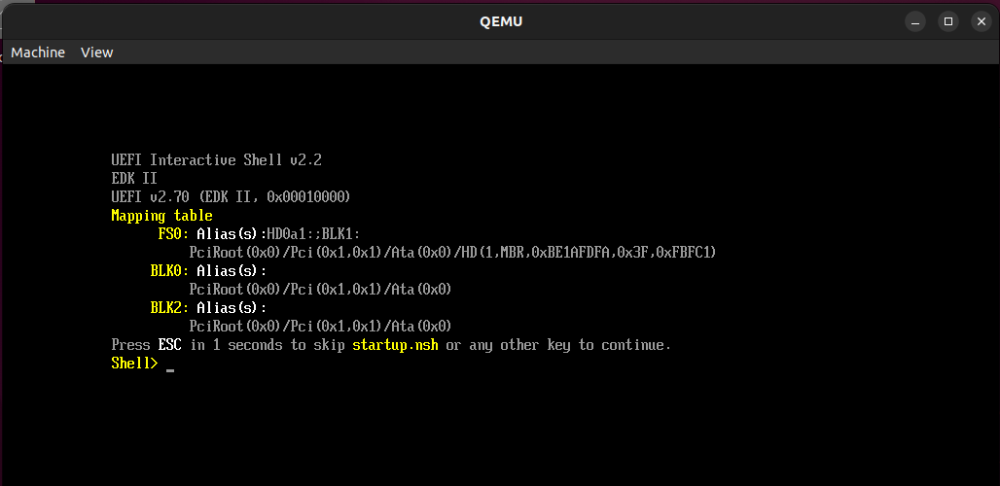

# UEFI_Platformer
Platformer game written for UEFI Shell.

Project inspired by https://github.com/rubikshift/UEFI_MARIO and written in C with the use of UEFI libraries.

Project uses Edk II for building the game.
Game was tested in Qemu with Ovmf.

The game can be run on real hardware (in UEFI shell), but due to not consistent performance and flickering it is recommended to run it in a virtual machine.

## Setup Edk II, OVMF and QEMU

Source: [_L_C_01_Build_Setup_Download_EDK_II_Linux_Lab.pdf](https://github.com/tianocore-training/Presentation_FW/blob/main/FW/Presentations/_L_C_01_Build_Setup_Download_EDK_II_Linux_Lab.pdf)

1. Install prerequisites

        sudo apt install build-essential uuid-dev iasl git python-is-python3 qemu-system-x86-64

2. Setup git with your email and username
3. Create workspace directory

        cd ~
        mkdir edk2-ws

4. Clone Github repositories with EDK II source code

        cd edk2-ws
        git clone -b Edk2Lab_22Q3 https://github.com/tianocore-training/edk2.git
        git clone https://github.com/tianocore/edk2-libc.git
        git clone https://github.com/tianocore/edk2-platforms.git
        git clone https://github.com/tianocore/edk2-non-osi.git
        git clone https://github.com/intel/FSP.git

5. Clone the EDK II Submodules

        cd edk2
        git submodule update --init
        cd ..
        cd edk2-platforms
        git reset --hard c546cc01f1517b42470f3ae44d67efcb8ee257fc

6. Clone Lab Material

        git clone https://github.com/tianocore-training/Lab_Material_FW.git
        cp -r Lab_Material_FW/FW/edk2-ws/ ../

7. Set ENV vars

        source setenv.sh
        env | grep -e WORKSPACE -e PACKAGES_PATH

8. Compile BaseTools

        cd edk2
        make -C BaseTools/

Source: [_L_C_01_Platform_Build_Linux_Ovmf_Lab.pdf](https://github.com/tianocore-training/Presentation_FW/blob/main/FW/Presentations/_L_C_01_Platform_Build_Linux_Ovmf_Lab.pdf)

9. Download general-purpose x86 assembler
    
        sudo apt install nasm

10. Build OVMF (Open Virtual Machine Firmware) with EDK II

        cd ~/edk2-ws/edk2
        source edksetup.sh

    Edit "Conf/target.txt"

        vim Conf/target.txt

    Make changes
        
        ACTIVE_PLATFORM = OvmfPkg/OvmfPkgX64.dsc
        # . . .
        TARGET_ARCH = X64
        # . . .
        TOOL_CHAIN_TAG = GCC5

    Save the file and build:

        build

11. Create QEMU Run Script
    
        cd ~
        mkdir run-ovmf
        cd run-ovmf

    Create a directory to use as a hard disk image for the virtual machine

        mkdir hda-contents

    Create "RunQemu.sh" script

        vim RunQemu.sh

    Copy this command inside the script

        qemu-system-x86_64 -drive file=bios.bin,format=raw,if=pflash -drive file=fat:rw:hda-contents,format=raw -net none -debugcon file:debug.log -global isa-debugcon.iobase=0x402 -display gtk,grab-on-hover=off,show-cursor=on,window-close=on

    Save the script and exit vim.

    Copy the OVMF binary that we build
    
        cp ~/edk2-ws/Build/OvmfX64/DEBUG_GCC5/FV/OVMF.fd ./bios.bin

    Test if everything works

        sh RunQemu.sh

    The UEFI shell should appear in QEMU

    

## Build and run the game

1. Make folders and copy files from my repository:

        cd ~/edk2-ws/edk2
        mkdir Platformer
        cd Platformer
        mkdir MyPkg
        cd MyPkg
        cp ~/UEFI_Platformer/src/MyPkg.dec .
        mkdir Platformer
        cd Platformer
        cp ~/UEFI_Platformer/src/Platformer.c .
        cp ~/UEFI_Platformer/src/Platformer.inf .

2. Open OvmfPkgX64.dsc

        cd ~/edk2-ws/edk2
        vim OvmfPkg/OvmfPkgX64.dsc 

3. Link the game by adding the line
    
        Platformer/MyPkg/Platformer/Platformer.inf

    to the end of the opened file. Remember to add two spaces before this line.

4. Save and exit vim.

5. Copy the "run" script

        cp ~/UEFI_Platformer/src/run .
        chmod +x run

6. Copy the game assets

        cp -r ~/UEFI_Platformer/images ~/run-ovmf/hda-contents
        cp -r ~/UEFI_Platformer/levels ~/run-ovmf/hda-contents

7. Build and run the game with this script

        ./run

8. Inside QEMU enter the filesystem

        fs0:
        ls

    Ls command should return these files:

    

9. Run the game

        Platformer.efi

10. Have fun!

## Running on real hardware

In order to run this game on real hardware you need to create a bootable pendrive with uefi shell and copy the game binary with other game assets.

## Implemented UEFI functionalities

Implemented in the game:
- Drawing on the screen with **Blt** function from "Protocol/GraphicsOutput.h".  (UEFI Spec. 2.10., page 426.)
- Keyboard input.
- Reading from files from "Protocol/SimpleFileSystem.h".
- Mouse input from "Protocol/SimplePointer.h".
- Timer.

Failed to implement in the game:
- Keyboard input with non-blocking keys - currently you can only press one key at a time.
- Mouse input in a virtual machine - Ovmf doesn't support the mouse input and adding mouse drivers from edk2 project doesn't help.

## Binaries

In "bin" folder there are few versions of the same binary file with the game, but with different screen resolutions (mentioned in the file names).

## Game assets

In order to run, game needs two folders with assets:
- images - with files inside:
  - player.bmp - player animation,
  - tiles.bmp - solid objects creating the terrain,
  - coins.bmp - coin animation,
  - castle.bmp - tiles needed to draw the whole castle sprite (game end goal),
  - digits.bmp - bitmap font for digits - used for displaying the current score,
  - cursor.bmp - mouse cursor,
- levels - with a file:
  - level.bin - information how to build the current game level.

Uefi accepts only .bmp images and binary files.

## Building levels

Game is using levelMaker.py script. It's a slightly modified version of https://github.com/rubikshift/UEFI_MARIO/blob/master/levelmaker.py

This python script converts a text file into a binary file. The text file consists of letters that correspond to game objects:
- **G** - green brick,
- **R** - red brick,
- **M** - mossy brick,
- **W** - web,
- **S** - web with a spider,
- **C** - coin,
- **P** - player spawn point,
- **E** - castle location - the end goal of the game.

Use dots or other ascii characters to fill the empty space between the game objects.

Use syntax:
    
    python levelMaker.py level.txt level.bin

Currently, the game can only load a map with a name: "level.bin".

## Game controls

- **ESC** - exit the game

- **Up Arrow** - jump

- **Left Arrow** - move to the left

- **Right Arrow** - move to the right

- **F1** - enable or disable mouse cursor (cursor is turn off by default)

- **F2** - teleport player to the mouse cursor

- **F5** - move mouse cursor to the left

- **F6** - move mouse cursor up

- **F7** - move mouse cursor down

- **F8** - move mouse cursor to the right

- **Left Mouse Button** - jump (not blocking alternative)

- **Right Mouse Button** - teleport player to the mouse cursor (alternative)

## Game objectives

The goal of the game is to reach the castle on the end of a loaded level.

While playing, player can collect coins that turn into a score displayed in the top left corner of the screen. If the player wins, score is also displayed on the end screen.

## Game screenshots

